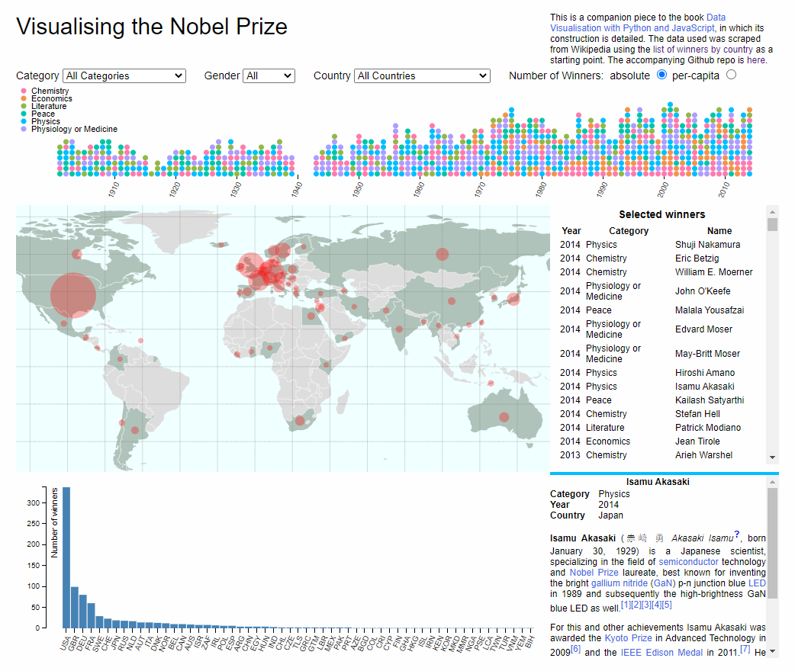
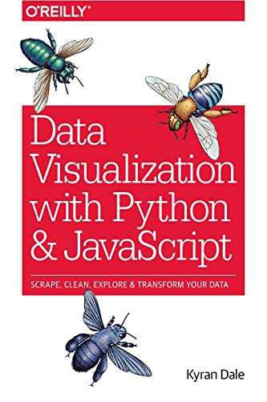

# Project Result

# Reference

# The skills set that I learned in the book
## Programming language
python, JavaScript
### Web Framework
Flask
## Web Scraping Frameworks
Scrapy, requests
## Data Analysis and Manipulation Tool
Pandas, Numpy
## Visualization tool
Matplotlib
## Database and Manipulation Tool
MongoDB, SQLite, sqlalchemy